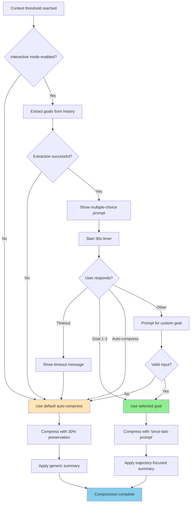

# Deliberate Context Compaction: Design Document

## Vision

Transform the current automatic compression system into a deliberate,
user-guided process that:

1. **Asks what the user is working on** to maintain session trajectory
2. **Makes summarization deliberate** with user input
3. **Preserves only the current exchange** (since last user prompt) instead of
   30%

## Decision Flow Diagram



**Key Decision Points**:

1. **Interactive mode check** - Settings determine if user sees prompt
2. **Goal extraction** - Model analyzes recent conversation
3. **30-second timer** - Prevents indefinite blocking
4. **User selection** - Determines compression strategy
5. **Strategy split** - Aggressive (goal-based) vs. Conservative (auto)

## Motivation (from blog post)

**Core Insight**: Automatic compression without user guidance can lose important
context. Deliberate, trajectory-focused compression maintains quality better.

**Key Philosophy**:

- Documentation > Summarization
- "Garbage in, garbage out" - remove irrelevant context deliberately
- Like solving a puzzle: easier when wrong pieces are eliminated
- Create durable, shareable artifacts instead of compressed context
- User knows what's important - ask them before compressing

**Compression Trigger**: Hybrid approach optimizes cost and performance while
enabling Gemini to learn about your work

## Learning Through Compression: A Feature, Not an Interruption

### The Opportunity

Compression check-ins provide valuable moments for Gemini to:

- **Understand your current trajectory** - What are you actually working on?
- **Learn your work patterns** - What tasks matter most to you?
- **Maintain alignment** - Ensure assistance stays relevant to your goals
- **Adapt to your preferences** - How often do you want guidance vs. autonomy?

Each time you select a goal, Gemini learns:

- What problems you're solving
- How you describe your work
- What level of engagement you prefer
- Whether you're switching contexts or staying focused

**Framing**: These aren't interruptions - they're alignment points where Gemini
checks in to ensure it's helping with what actually matters to you.

### User Preference Signals

Every interaction teaches Gemini about you:

**Selecting a specific goal (options 1-3)**:

- "I want guidance and alignment"
- "I appreciate when you understand my trajectory"
- "Check-ins help me stay focused"

**Selecting "Auto-compress"**:

- "I'm in flow, don't need guidance right now"
- "This session is straightforward"
- "I trust the system to handle this automatically"

**Selecting "Check in less often"**:

- "I prefer more autonomy"
- "These check-ins are more frequent than I need"
- "Increase the threshold for when you check in"

**Selecting "Don't ask me again"**:

- "I prefer fully autonomous operation"
- "I'll manage context myself"
- "Compression should be invisible"

Each response helps Gemini adapt to your working style - whether you prefer
collaborative alignment or autonomous operation.

## Cost & Performance Optimization

### The Problem with Utilization-Only Triggering

**Gemini 3 Pro** has a **1M token context window**. At 50% utilization:

- Compression triggers at **500,000 tokens**
- Every API call processes all 500k tokens
- 20 API calls = 10M input tokens processed
- Cost: ~$70 per session (at $0.007/1k tokens)

**Quality degradation** occurs with very long contexts:

- "Lost in the middle" problem - model misses important information
- Attention mechanism struggles with 100k+ token contexts
- Slower response times with massive context

### The Hybrid Solution

**Primary trigger: 40,000 tokens** (absolute) **Safety valve: 50% utilization**
(relative) **Learning frequency: 25 messages + 5 minutes** between check-ins

**Example Cost Savings (Gemini 3 Pro):**

**Typical Session (60 messages, ~90k tokens total)**

_Without compression_ (utilization-only never triggers):

```
Context grows: 1.5k → 3k → 4.5k → ... → 90k
Total tokens processed over 60 API calls:
  = 1.5k + 3k + 4.5k + ... + 90k
  = 2.745M tokens
Cost: 2.745M × $0.001/1k = $2.75
```

_With hybrid (40k trigger)_:

```
First compression at message 27 (40.5k tokens)
  → Compresses to ~4.5k

Tokens processed messages 1-27: 567k
Tokens processed messages 28-51: 558k
Tokens processed messages 52-60: 108k

Total: 1.233M tokens
Cost: 1.233M × $0.001/1k = $1.23

Savings: $1.52 per session (55% reduction)
```

**Long Session (240+ messages):**

- Utilization-only: ~$43
- Hybrid: ~$6
- Savings: 86%

**Key takeaway**: Typical sessions save ~55%, long sessions save 80-90%.

**Performance Benefits:**

- Faster API responses (less to process)
- Better output quality (focused context)
- Reduced latency
- Improved model attention on relevant information

**User Experience:**

- Typical session: 1-2 learning check-ins where Gemini understands your work
- Check-in frequency ensures meaningful activity between interactions
- Safety valve ensures system health at 50%
- User controls check-in frequency: more guidance vs. more autonomy

## Design Principles

### 1. User-Guided Trajectory Maintenance Through Learning

**Current Problem**: Automatic compression summarizes without understanding
user's current focus or learning from their work patterns

**New Approach**: Regular check-ins where Gemini learns about user's work:

> "💭 Let me learn about what you're working on" "Context: 42k tokens (4%)"
>
> "What are you currently working on?"
>
> 1. Implementing user authentication system
> 2. Debugging API connection errors
> 3. Refactoring database schema
> 4. Auto-compress (default behavior)
> 5. Other (specify)
> 6. Don't ask me again
> 7. Check in less often

**Why This Matters**:

- **Learning opportunity**: Gemini understands what you're actually working on
- **Trajectory awareness**: Knows if you're switching contexts or staying
  focused
- **Preference adaptation**: Learns how much guidance vs. autonomy you prefer
- **Fast interaction**: Single keypress selection vs. open-ended typing
- **Demonstrated understanding**: Shows Gemini "sees" your recent work
- **Smart compression**: Summary emphasizes context relevant to your stated goal
- **User control**: Can adjust check-in frequency or disable entirely

### 2. Deliberate Summarization

**Current**: Silent automatic compression with fixed XML structure

**New**: Interactive compression flow

1. Detect threshold crossed
2. Pause to ask user what they're working on
3. Use answer to guide compression prompt
4. Show user what will be preserved vs. compressed
5. Generate trajectory-focused summary

### 3. Aggressive Context Preservation Strategy

**Current**: Preserve latest 30% of history

**New**: Preserve only "since previous prompt"

**Interpretation**: Keep only the most recent user-assistant exchange

- Last user message + assistant response + current turn
- Everything before gets compressed into summary
- More aggressive: keeps ~5-10 messages vs. 30% of all messages

**Rationale**:

- Recent exchange has all immediate context needed
- Earlier exchanges should be documented, not carried forward
- Forces better compression and documentation practices
- Aligns with blog post philosophy: document and clear

## Components to Modify

### Component 1: Threshold Detection & User Prompt

**Files Affected**:

- `packages/core/src/core/client.ts` (GeminiClient.tryCompressChat)
- `packages/core/src/agents/executor.ts` (agent compression trigger)

**Current Behavior**:

```typescript
// Silently checks threshold and compresses
const result = await this.compressionService.compress(...)
```

**New Behavior**:

```typescript
// 0. Smart threshold detection (hybrid approach)
const { shouldCompress, isSafetyValve } = this.shouldTriggerCompression()

if (shouldCompress && !force) {
    // 1. Extract potential goals from recent history
    const goalOptions = await this.extractGoalOptions(chat.history)

    // 2. Ask user to select their current goal (with opt-out options if not safety valve)
    const userGoal = await promptUserForCurrentGoal(
        currentUtilization,
        currentTokens,
        goalOptions,
        isSafetyValve  // Hide opt-out options if forced by 50% limit
    )

    // Handle opt-out selections
    if (userGoal === 'disable') {
        this.config.setCompressionInteractive(false)
        // Fall through to auto-compress this time
        userGoal = 'auto'
    }

    if (userGoal === 'less-frequent') {
        this.config.setCompressionTriggerTokens(
            this.config.getCompressionTriggerTokens() + 20000
        )
        this.config.setCompressionMinMessages(
            this.config.getCompressionMinMessages() + 15
        )
        // Fall through to auto-compress this time
        userGoal = 'auto'
    }

    // 3. Pass goal to compression service
    const result = await this.compressionService.compress({
        ...,
        userGoal: userGoal === 'auto' ? undefined : userGoal,
        preserveStrategy: userGoal === 'auto' ? 'percentage' : 'since-last-prompt'
    })

    // 4. Track compression for anti-annoyance guards
    this.lastCompressionTime = Date.now()
    this.messagesSinceLastCompress = 0
}
```

**New Methods Needed**:

**Method 0**:
`shouldTriggerCompression(): { shouldCompress: boolean, isSafetyValve: boolean }`

**Purpose**: Hybrid trigger logic with learning frequency management and safety
valve detection

**Implementation**:

```typescript
private lastCompressionTime: number = 0
private messagesSinceLastCompress: number = 0

shouldTriggerCompression(): { shouldCompress: boolean, isSafetyValve: boolean } {
    const currentTokens = this.getCurrentTokenCount()
    const modelMaxTokens = this.getModelMaxTokens()

    const absoluteThresholdReached =
        currentTokens > this.config.getCompressionTriggerTokens()

    const utilizationThresholdReached =
        (currentTokens / modelMaxTokens) > this.config.getCompressionTriggerUtilization()

    // Safety valve: MUST compress at utilization threshold
    // Don't show opt-out options when forced by safety valve
    if (utilizationThresholdReached) {
        return { shouldCompress: true, isSafetyValve: true }
    }

    // Check absolute threshold with learning frequency controls
    if (absoluteThresholdReached) {
        // Check 1: Enough messages since last check-in for meaningful learning
        if (this.messagesSinceLastCompress < this.config.getCompressionMinMessages()) {
            return { shouldCompress: false, isSafetyValve: false }
        }

        // Check 2: Enough time since last check-in to respect user's preferred pace
        const minTimeBetween = this.config.getCompressionMinTimeBetweenPrompts() * 1000
        if (Date.now() - this.lastCompressionTime < minTimeBetween) {
            return { shouldCompress: false, isSafetyValve: false }
        }

        return { shouldCompress: true, isSafetyValve: false }
    }

    return { shouldCompress: false, isSafetyValve: false }
}

// Increment on each new message
onNewMessage() {
    this.messagesSinceLastCompress++
}
```

**Why This Works**:

- **40k token check-in point**: Cost optimization + natural learning opportunity
- **50% utilization safety valve**: Must compress by this point
- **25 message minimum**: Ensures enough activity for meaningful context before
  check-in
- **5 minute pacing**: Respects user's workflow rhythm and focus time

**Example Behavior (Gemini 3 Pro with 1M context)**:

```
Session start: 0 tokens, 0 messages

After 20 messages: 40k tokens
  → Check: 40k > 40k ✓, messages: 20 < 25 ✗
  → Not enough new activity to learn from yet

After 25 messages: 50k tokens
  → Check: 50k > 40k ✓, messages: 25 >= 25 ✓, time: >5min ✓
  → CHECK IN: "What are you working on?" 💭
  → Learn about user's goal, compress to 10k tokens

After 20 more messages: 40k tokens (30k new + 10k old)
  → Check: 40k > 40k ✓, messages: 20 < 25 ✗
  → Not enough new activity since last check-in

After 25 more messages: 50k tokens
  → Check: 50k > 40k ✓, messages: 25 >= 25 ✓, time: >5min ✓
  → CHECK IN AGAIN: Learn about continued work or context switch
  → Compress based on new goal

Worst case: User hasn't responded to check-ins, reaches 500k tokens (50% utilization)
  → Safety valve: Required compression (opt-out options hidden)
  → System health takes priority
```

**Safety Valve Behavior**: When the 50% utilization threshold is hit:

- Compression is **required for system health** (not optional)
- Opt-out options ("Don't ask me again", "Check in less often") are **hidden**
- User can still select goals or auto-compress to maintain trajectory awareness
- This ensures system stability even if user has been declining check-ins

**New Methods Needed (continued)**:

**Method 1**: `extractGoalOptions(history: Content[]): Promise<string[]>`

**Purpose**: Analyze recent conversation to identify what user might be working
on

**Performance Optimization**: Only include:

- Full user messages (typically short)
- Beginning and end of assistant messages (truncated middle)
- Avoids sending full code blocks, long tool outputs, etc.

**Error Handling**:

```typescript
try {
  const goals = await extractGoalOptions(history);
  if (!goals || goals.length === 0) {
    // Extraction failed - fall back to generic options
    return [
      'Continue current task',
      'Debug recent errors',
      'Implement new feature',
    ];
  }
  return goals;
} catch (error) {
  // Model error or parsing failure
  console.error('Goal extraction failed:', error);
  // Skip interactive prompt, go straight to auto-compress
  return 'auto';
}
```

**Implementation Approach**: Use the model to extract goals

```typescript
async extractGoalOptions(history: Content[]): Promise<string[]> {
    // Take last ~10-15 exchanges (enough context, not too much)
    const recentHistory = history.slice(-30)

    // Truncate assistant messages for performance
    const compactHistory = recentHistory.map(message => {
        if (message.role === 'user') {
            // Keep full user messages (usually short)
            return message
        } else {
            // For assistant/model messages, keep beginning + end only
            return truncateMiddle(message, {
                keepStart: 500,  // First 500 chars
                keepEnd: 300     // Last 300 chars
            })
        }
    })

    // Prompt model to extract 3-4 distinct goals/tasks
    const prompt = `
        Analyze this conversation and identify 3-4 distinct tasks or goals
        the user appears to be working on. Be specific and concise.

        Format as a simple numbered list:
        1. [First task]
        2. [Second task]
        3. [Third task]

        Focus on concrete tasks, not meta-commentary.
    `

    const response = await this.chat.sendMessage([
        { role: 'user', parts: [{ text: prompt }] },
        { role: 'user', parts: [{ text: JSON.stringify(compactHistory) }] }
    ])

    // Parse response into array of goals
    return parseGoalsFromResponse(response.text())
}

// Helper function
function truncateMiddle(
    message: Content,
    options: { keepStart: number, keepEnd: number }
): Content {
    const text = extractTextFromMessage(message)

    if (text.length <= options.keepStart + options.keepEnd) {
        return message  // No truncation needed
    }

    const start = text.slice(0, options.keepStart)
    const end = text.slice(-options.keepEnd)
    const truncated = `${start}\n\n[... ${text.length - options.keepStart - options.keepEnd} chars omitted ...]\n\n${end}`

    return {
        ...message,
        parts: [{ text: truncated }]
    }
}
```

**Method 2**:
`promptUserForCurrentGoal(utilization: number, options: string[]): Promise<string | 'auto' | 'disable' | 'less-frequent'>`

**Purpose**: Present multiple-choice to user with opt-out options

**Parameters**:

- `utilization`: Context percentage (e.g., 0.52 for 52%)
- `options`: Array of 3-4 extracted goals

**Returns**:

- Selected goal text (if options 1-3 or custom from "Other")
- `'auto'` if user chooses default auto-compress or timeout occurs
- `'disable'` if user chooses "Don't ask me again"
- `'less-frequent'` if user chooses "Ask me less frequently"

**Behavior**:

- Display current token count and utilization percentage
- Show extracted goal options (1-3 or 1-4)
- Show "Auto-compress (default behavior)" option
- Show "Other (specify)" option
- **Show "Don't ask me again" option** (disables interactive mode)
- **Show "Ask me less frequently" option** (increases thresholds)
- Wait for user selection with 30-second timeout
- If timeout expires: automatically select "Auto-compress" option
- If "Other", prompt for text input
- If "Don't ask me again", disable interactive compression
- If "Ask me less frequently", adjust thresholds and save to config
- Return selected/entered goal or special value

**Opt-Out Handling**:

```typescript
if (selection === 'disable') {
  // Disable interactive compression
  config.setCompressionInteractive(false);
  showMessage(
    'Interactive compression disabled. Future compressions will be automatic.',
  );
  return 'auto'; // Proceed with auto-compress for this time
}

if (selection === 'less-frequent') {
  // Apply multiplier to make check-ins less frequent
  const currentTokens = config.getCompressionTriggerTokens();
  const currentMessages = config.getCompressionMinMessages();
  const multiplier = config.getCompressionFrequencyMultiplier(); // Default: 1.5x

  const newTokens = Math.round(currentTokens * multiplier);
  const newMessages = Math.round(currentMessages * multiplier);

  // Cap at maximum values
  const cappedTokens = Math.min(newTokens, 200000);
  const cappedMessages = Math.min(newMessages, 100);

  config.setCompressionTriggerTokens(cappedTokens);
  config.setCompressionMinMessages(cappedMessages);

  showMessage(
    `Check-ins ${multiplier}x less frequent: ${currentTokens / 1000}k → ${cappedTokens / 1000}k tokens, ${currentMessages} → ${cappedMessages} messages`,
  );
  return 'auto'; // Proceed with auto-compress for this time
}
```

**Important Note**: These opt-out options are **only available during
interactive prompts**, not when the 50% utilization safety valve forces
compression.

**Dynamic Frequency Adjustment**:

The "Check in less often" option uses a **multiplier system** (default 1.5x)
that scales naturally:

```typescript
// Each selection multiplies current thresholds
newTokenThreshold = currentTokenThreshold × multiplier
newMessageThreshold = currentMessageThreshold × multiplier

// Examples with 1.5x multiplier:
Initial:  40,000 tokens, 25 messages
Select 1: 60,000 tokens, 38 messages  (×1.5)
Select 2: 90,000 tokens, 57 messages  (×1.5² = 2.25)
Select 3: 135,000 tokens, 86 messages (×1.5³ = 3.375)
Select 4: 200,000 tokens, 100 messages (capped)
```

**Why Dynamic Multiplier vs. Fixed Increments?**

- ✅ Scales naturally with user's current preferences
- ✅ Consistent relative reduction each time
- ✅ Works across different starting thresholds
- ✅ User can fine-tune by selecting multiple times
- ✅ Configurable multiplier (1.2x conservative → 3.0x aggressive)
- ❌ Fixed "+20k tokens" doesn't scale well from 40k vs 100k

**User Experience**:

- First selection: "Check-ins 1.5x less frequent"
- Second selection: "Check-ins 2.25x less frequent" (cumulative)
- Third selection: "Check-ins 3.4x less frequent" (cumulative)
- System shows current multiplier in feedback message

**Visual Progression** (40k token start, 1.5x multiplier):

```
Default frequency:  ●--------●--------●--------●  (every 40k)
After 1x "less":    ●-------------●-------------  (every 60k, 1.5x)
After 2x "less":    ●-------------------●--------  (every 90k, 2.25x)
After 3x "less":    ●----------------------------  (every 135k, 3.375x)
```

User quickly finds their preferred frequency through repeated selections,
without needing to manually configure token thresholds.

**Opt-Out vs Safety Valve Interaction**:

| Scenario                      | 40k Token Trigger    | 50% Safety Valve   |
| ----------------------------- | -------------------- | ------------------ |
| **Prompt shown?**             | Yes (if guards pass) | Yes (always)       |
| **Goal selection?**           | Yes                  | Yes                |
| **"Don't ask me again"?**     | ✅ Available         | ❌ Hidden          |
| **"Ask me less frequently"?** | ✅ Available         | ❌ Hidden          |
| **Can user skip?**            | Yes (timeout/auto)   | No (must compress) |

**Rationale**:

- At 40k tokens: User has choice, can adjust preferences
- At 50% utilization: Compression is mandatory for system health
- If user consistently chooses "less frequent", they may never hit safety valve
- If user ignores prompts, safety valve ensures compression happens

**Timeout Behavior**:

```typescript
async promptUserForCurrentGoal(
    utilization: number,
    options: string[]
): Promise<string> {
    const TIMEOUT_MS = 30000  // 30 seconds

    const prompt = createMultipleChoicePrompt({
        question: 'What are you currently working on?',
        options: [
            ...options,
            'Auto-compress (default behavior)',
            'Other (specify)'
        ],
        timeout: TIMEOUT_MS,
        defaultOption: options.length + 1  // Index of "Auto-compress"
    })

    try {
        const selection = await Promise.race([
            showPromptAndWaitForResponse(prompt),
            sleep(TIMEOUT_MS).then(() => 'TIMEOUT')
        ])

        if (selection === 'TIMEOUT') {
            // Show message that auto-compress was selected
            showTimeoutMessage('No response in 30s, using auto-compress')
            return 'auto'
        }

        // Handle user's actual selection
        return handleSelection(selection, options)
    } catch (error) {
        // On any error, fall back to auto-compress
        return 'auto'
    }
}
```

**Timeout UX**:

- Show countdown in prompt (optional): "Auto-compress in 30s..."
- When timeout occurs: Brief message "Using auto-compress (no response)"
- Non-intrusive: Just continues with default behavior
- Prevents hanging indefinitely if user steps away

**UI Challenge**: This needs to interrupt the flow

- In CLI: Use AskUserQuestion-style multiple-choice prompt with timeout
- In agent mode: Use agent's current task (skip prompt)
- Need to handle non-interactive scenarios (CI/CD) - default to 'auto'

### Component 2: Split Point Logic

**Files Affected**:

- `packages/core/src/services/chatCompressionService.ts` (findCompressSplitPoint
  function)

**Current Logic** (lines 36-76):

```typescript
function findCompressSplitPoint(
  history: Content[],
  preserveThreshold: number = COMPRESSION_PRESERVE_THRESHOLD, // 0.3
);
```

**Calculates**:

- Uses character count / 4 as token proxy
- Finds point that preserves 30% of tokens
- Splits at safe user message boundary

**New Logic**:

```typescript
function findCompressSplitPoint(
  history: Content[],
  preserveStrategy: 'percentage' | 'since-last-prompt',
  preserveThreshold?: number,
);
```

**For 'since-last-prompt' strategy**:

1. Find the last user message in history
2. Everything before that user message → compress
3. That user message + subsequent messages → preserve

**Implementation**:

```typescript
if (preserveStrategy === 'since-last-prompt') {
  // Find last user message index
  let lastUserMessageIndex = -1;
  for (let i = history.length - 1; i >= 0; i--) {
    if (history[i].role === 'user') {
      lastUserMessageIndex = i;
      break;
    }
  }

  if (lastUserMessageIndex <= 0) {
    // No split possible, history too short
    return null;
  }

  return {
    historyToCompress: history.slice(0, lastUserMessageIndex),
    historyToKeep: history.slice(lastUserMessageIndex),
  };
}
```

**Edge Cases**:

- What if history has only 1-2 user messages? (Don't compress)
- What if last user message is very recent? (Might not save much)
- What if previous work is still relevant? (User's goal guides summary)

### Component 3: Compression Prompt Enhancement

**Files Affected**:

- `packages/core/src/core/prompts.ts` (getChatCompressionPrompt function, lines
  353-411)

**Current Prompt**: Generic compression with fixed XML structure

**New Prompt Additions**:

**Section 1: User's Current Goal** (prepended to prompt)

```xml
The user has indicated they are currently working on:
<current_goal>
{userGoal}
</current_goal>

When creating your summary, prioritize information relevant to this goal.
De-emphasize or omit details unrelated to the current trajectory.
```

**Section 2: Trajectory-Focused Instructions**

Add to instructions:

```
- Focus on information relevant to the user's current goal stated above
- Omit tangents, abandoned approaches, or unrelated discussions
- In <current_plan>, highlight only steps relevant to the current goal
- In <key_knowledge>, prioritize facts needed for the current trajectory
- Be aggressive about discarding irrelevant context
```

**Section 3: Updated XML Structure**

Consider adding:

```xml
<state_snapshot>
    <current_goal>
        <!-- From user's stated goal -->
    </current_goal>

    <relevant_context>
        <!-- Only context needed for current goal -->
    </relevant_context>

    <file_system_state>
        <!-- Files relevant to current goal -->
    </file_system_state>

    <next_steps>
        <!-- Immediate next actions for current goal -->
    </next_steps>

    <discarded_context_summary>
        <!-- One sentence about what was omitted and why -->
    </discarded_context_summary>
</state_snapshot>
```

**Why add 'discarded_context_summary'?**

- User knows what was dropped
- Can ask to restore if needed
- Transparency in compression decisions

### Component 4: Interactive Compression UI

**Files Affected**:

- `packages/cli/src/ui/components/messages/CompressionMessage.tsx`
- New component: `CompressionPrompt.tsx` (for asking user's goal)

**Current UI**: Shows compression result after it happens

**New UI Flow**:

**Step 1: Goal Selection & Learning Check-In**

```
┌─────────────────────────────────────────────┐
│ 💭 Let me learn about what you're working on│
│ Context: 42k tokens (4%)                    │
│                                             │
│ What are you currently working on?          │
│                                             │
│  1. Implementing user authentication        │
│  2. Debugging API connection timeout        │
│  3. Refactoring database schema             │
│  4. Auto-compress (default behavior)        │
│  5. Other (specify)                         │
│                                             │
│  6. Don't ask me again                      │
│  7. Check in less often                     │
│                                             │
│ Select [1-7] (auto-compress in 30s): _     │
└─────────────────────────────────────────────┘
```

**If timeout occurs (no response in 30s)**:

```
┌─────────────────────────────────────────────┐
│ No response received, using auto-compress   │
└─────────────────────────────────────────────┘
```

**If user selects "5. Other"**:

```
┌─────────────────────────────────────────────┐
│ What are you working on?                    │
│ > _                                         │
└─────────────────────────────────────────────┘
```

**If user selects "6. Don't ask me again"**:

```
┌─────────────────────────────────────────────┐
│ Interactive compression disabled             │
│ Future compressions will be automatic       │
│                                             │
│ Re-enable in settings:                      │
│ compressionInteractive = true               │
└─────────────────────────────────────────────┘
```

**If user selects "7. Ask me less frequently"**:

```
┌─────────────────────────────────────────────┐
│ I'll check in 1.5x less often to learn      │
│ about what you're working on                │
│                                             │
│ Updated thresholds:                         │
│ • Tokens: 40k → 60k (1.5x)                 │
│ • Messages: 25 → 38 (1.5x)                 │
│                                             │
│ Select again to reduce frequency further   │
└─────────────────────────────────────────────┘
```

**Step 2: Compression Preview**

```
┌─────────────────────────────────────────────┐
│ Compressing chat history...                 │
│                                             │
│ Goal: Implementing user authentication      │
│ Preserving: Last 2 messages (since prompt)  │
│ Compressing: 45 earlier messages            │
│                                             │
│ [████████░░] 80%                           │
└─────────────────────────────────────────────┘
```

**Step 3: Compression Result**

```
┌─────────────────────────────────────────────┐
│ ✓ Chat history compressed                   │
│                                             │
│ Before: 52,345 tokens                       │
│ After:  18,234 tokens (65% reduction)       │
│ Preserved: Last 2 messages                  │
│                                             │
│ Context now optimized for: Implementing     │
│ user authentication                         │
└─────────────────────────────────────────────┘
```

**Component Structure**:

```typescript
// New component for asking user goal
interface CompressionPromptProps {
  utilizationPercent: number;
  currentTokens: number;
  goalOptions: string[]; // Extracted from conversation
  onGoalSelect: (goal: string | 'auto' | 'disable' | 'less-frequent') => void;
  timeoutMs?: number; // Default: 30000 (30 seconds)
  isSafetyValve: boolean; // True if forced by 50% limit (hides opt-out options)
}

// Goal options will be:
// - goalOptions[0-2]: Extracted goals from conversation
// - "Auto-compress (default behavior)": Special option
// - "Other (specify)": Triggers text input
// - "Don't ask me again": Disables interactive compression (not shown if isSafetyValve=true)
// - "Ask me less frequently": Increases thresholds (not shown if isSafetyValve=true)

// Timeout behavior:
// - After 30 seconds with no response, automatically select "Auto-compress"
// - Show timeout message: "No response received, using auto-compress"
// - Continue with percentage-based preservation (original behavior)

// When user selects "Auto-compress" (or timeout):
// - Returns 'auto' as the goal
// - preserveStrategy: 'percentage' (old 30% preservation)
// - No trajectory focusing in compression prompt
// - Identical to original automatic compression

// When user selects "Don't ask me again":
// - Sets compressionInteractive = false in config
// - Returns 'auto' for this compression
// - Future compressions will be automatic (no prompts)

// When user selects "Ask me less frequently":
// - Increases compressionTriggerTokens by 20k
// - Increases compressionMinMessages by 15
// - Returns 'auto' for this compression
// - Future prompts will be less frequent

// Enhanced compression message
interface CompressionMessageProps {
  status: CompressionStatus;
  tokensBeforeCompression?: number;
  tokensAfterCompression?: number;
  userGoal?: string; // NEW: selected goal or 'auto'
  messagesPreserved?: number; // NEW
  messagesCompressed?: number; // NEW
  goalWasSelected?: boolean; // NEW: true if user chose a goal vs auto
}
```

### Component 5: Compression Service API

**Files Affected**:

- `packages/core/src/services/chatCompressionService.ts` (compress method
  signature)

**Current Signature**:

```typescript
async compress(
    chat: GenerativeModel | GoogleGenerativeAI,
    promptId: string,
    force: boolean,
    model: string,
    config: GeminiClientConfig,
    hasFailedCompressionAttempt: boolean
): Promise<CompressResult>
```

**New Signature**:

```typescript
async compress(
    chat: GenerativeModel | GoogleGenerativeAI,
    promptId: string,
    options: CompressionOptions
): Promise<CompressResult>

interface CompressionOptions {
    force: boolean
    model: string
    config: GeminiClientConfig
    hasFailedCompressionAttempt: boolean

    // NEW OPTIONS
    userGoal?: string  // User's stated current goal
    preserveStrategy: 'percentage' | 'since-last-prompt'
    preserveThreshold?: number  // Only used for 'percentage' strategy
    interactive?: boolean  // Whether to show UI prompts
}

interface CompressResult {
    status: CompressionStatus
    newHistory?: Content[]
    tokensBeforeCompression?: number
    tokensAfterCompression?: number

    // NEW FIELDS
    messagesPreserved?: number
    messagesCompressed?: number
    discardedContextSummary?: string  // From XML output
}
```

**Compression Behavior Based on User Selection**:

| User Selection               | preserveStrategy    | userGoal           | Compression Prompt                  | Result                                 |
| ---------------------------- | ------------------- | ------------------ | ----------------------------------- | -------------------------------------- |
| Extracted goal (options 1-3) | 'since-last-prompt' | Selected goal text | Trajectory-focused with goal        | Aggressive: only current exchange kept |
| "Auto-compress"              | 'percentage'        | undefined          | Generic (original)                  | Conservative: 30% preserved            |
| "Other" → custom text        | 'since-last-prompt' | Custom text        | Trajectory-focused with custom goal | Aggressive: only current exchange kept |

**Key Differences**:

- **Goal-based compression**: Preserves less (aggressive), focuses summary on
  trajectory
- **Auto-compress**: Preserves more (conservative), generic summary (original
  behavior)

### Component 6: Non-Interactive Mode Handling

**Challenge**: What happens in agent mode or non-interactive scenarios?

**Files Affected**:

- `packages/core/src/agents/executor.ts`

**Options**:

**Option A: Skip user prompt in agent mode**

- Agent compression remains automatic
- Only interactive CLI sessions prompt for goal
- Agent uses default 'since-last-prompt' strategy

**Option B: Agent infers goal from current task**

- Agent already has a task/goal in memory
- Pass agent's current task as "userGoal"
- No prompt needed, but still trajectory-focused

**Option C: Make agent compression less aggressive**

- Agent stays with percentage-based preservation
- Only human-interactive sessions use deliberate compression

**Recommendation**: Option B

- Agents already have explicit goals
- Can reuse same trajectory-focused compression
- No UX interruption needed

**Implementation**:

```typescript
// In agent executor
async tryCompressChat(chat: GoogleGenerativeAI, promptId: string) {
    const result = await this.compressionService.compress({
        // ...existing params
        userGoal: this.currentTask?.description,  // Use agent's task
        preserveStrategy: 'since-last-prompt',
        interactive: false  // No UI prompts
    })
}
```

### Component 7: Configuration & Settings

**Files Affected**:

- `packages/cli/src/config/settingsSchema.ts`

**New Settings**:

```typescript
compressionStrategy: {
    type: 'string',
    enum: ['percentage', 'since-last-prompt'],
    default: 'since-last-prompt',
    description: 'How much history to preserve after compression',
    requiresRestart: true
}

compressionInteractive: {
    type: 'boolean',
    default: true,
    description: 'Ask what you\'re working on before compressing',
    requiresRestart: false
}

compressionPromptTimeout: {
    type: 'number',
    default: 30,
    description: 'Seconds to wait for goal selection before auto-compressing',
    requiresRestart: false,
    min: 10,
    max: 300
}

// Hybrid trigger approach: absolute + utilization
compressionTriggerTokens: {
    type: 'number',
    default: 40000,
    description: 'Trigger compression at this token count (cost optimization)',
    requiresRestart: false,
    min: 10000,
    max: 200000
}

compressionTriggerUtilization: {
    type: 'number',
    default: 0.50,
    description: 'Maximum utilization before forcing compression (safety valve)',
    requiresRestart: false,
    min: 0.3,
    max: 0.95
}

compressionMinMessagesSinceLastCompress: {
    type: 'number',
    default: 25,
    description: 'How often to check in on what you\'re working on (in messages)',
    requiresRestart: false,
    min: 5,
    max: 100
}

compressionMinTimeBetweenPrompts: {
    type: 'number',
    default: 300,
    description: 'How often to check in on your work (in seconds)',
    requiresRestart: false,
    min: 60,
    max: 1800
}

compressionFrequencyMultiplier: {
    type: 'number',
    default: 1.5,
    description: 'Multiplier when user requests less frequent check-ins',
    requiresRestart: false,
    min: 1.2,
    max: 3.0
}

// Why 1.5x default?
// - Noticeable reduction (50% less frequent) without being too aggressive
// - 2-3 selections reach comfortable autonomous frequency (2.25x-3.375x)
// - Conservative enough to try once, aggressive enough to be effective
// - Allows fine-tuning: select again if still too frequent
// - Users who want bigger jumps can configure to 2.0x or higher
```

**Config Access**:

```typescript
config.getCompressionStrategy(): 'percentage' | 'since-last-prompt'
config.isCompressionInteractive(): boolean
config.getCompressionPromptTimeout(): number  // In seconds
config.getCompressionTriggerTokens(): number
config.getCompressionTriggerUtilization(): number
config.getCompressionMinMessages(): number
config.getCompressionMinTimeBetweenPrompts(): number  // In seconds
config.getCompressionFrequencyMultiplier(): number  // Default: 1.5
```

### Component 8: Telemetry Updates

**Files Affected**:

- `packages/core/src/telemetry/loggers.ts` (logChatCompression)

**Current Event Data**:

```typescript
{
    event: 'chat_compression',
    tokens_before: number,
    tokens_after: number
}
```

**Enhanced Event Data**:

```typescript
{
    event: 'chat_compression',
    tokens_before: number,
    tokens_after: number,

    // NEW FIELDS
    preserve_strategy: 'percentage' | 'since-last-prompt',
    messages_preserved: number,
    messages_compressed: number,
    had_user_goal: boolean,
    interactive_mode: boolean,
    utilization_at_trigger: number,

    // Goal selection tracking
    goal_selection_method?: 'manual' | 'timeout' | 'auto' | 'agent',
    goal_extraction_success?: boolean,
    goal_extraction_duration_ms?: number,
    prompt_timeout_occurred?: boolean,

    // Trigger tracking
    trigger_type?: 'absolute_tokens' | 'utilization_threshold',
    tokens_at_trigger?: number,
    messages_since_last_compress?: number,
    time_since_last_compress_seconds?: number,

    // Opt-out tracking
    user_selected_disable?: boolean,          // Selected "Don't ask me again"
    user_selected_less_frequent?: boolean,    // Selected "Check in less often"
    was_safety_valve?: boolean,               // True if forced by 50% limit

    // Frequency adjustment tracking
    frequency_multiplier_applied?: number,    // Multiplier used (e.g., 1.5)
    cumulative_frequency_reduction?: number,  // Total reduction (e.g., 2.25x)
    new_token_threshold?: number,             // New threshold after adjustment
    new_message_threshold?: number,           // New message count after adjustment
    times_less_frequent_selected?: number     // How many times user has selected this
}
```

**Goal Selection Methods**:

- `'manual'`: User actively selected a goal (options 1-3 or "Other")
- `'timeout'`: 30-second timeout expired, auto-selected auto-compress
- `'auto'`: User explicitly chose "Auto-compress" option
- `'agent'`: Agent mode, used agent's task

**Trigger Types**:

- `'absolute_tokens'`: Triggered by reaching absolute token threshold (40k
  default)
- `'utilization_threshold'`: Triggered by reaching utilization threshold (50%
  default)

**Why Track This**:

- Understand user adoption of deliberate compression
- Compare effectiveness of strategies
- **Monitor trigger patterns**: How often absolute vs. utilization?
- **Validate anti-annoyance guards**: Are they working?
- **Track timeout frequency**: How often do users not respond?
- **Measure goal extraction performance**: Is it fast enough?
- **Compare outcomes**: Manual goal selection vs. timeout vs. explicit auto
- **Cost impact**: Measure actual token savings from hybrid approach
- **User preference patterns**: How do users signal their preferred level of
  guidance?
  - High manual goal selection → users value alignment and guidance
  - High auto-compress rate → users prefer autonomous operation
  - "Check in less often" usage → track multiplier applications and cumulative
    reductions
  - Average cumulative multiplier → optimal default frequency (1x, 1.5x, 2.25x,
    etc.)
  - "Don't ask me again" rate → some users prefer fully autonomous compression
  - Safety valve frequency → indicates if check-in pacing is appropriate
  - Multiplier effectiveness → does 1.5x feel right or should default be 1.3x or
    2.0x?
- A/B test different approaches and default multipliers (1.3x vs 1.5x vs 2.0x)

## Implementation Dependencies & Reusable Components

### Existing Components to Reuse

**1. AskUserQuestion Tool Pattern**

- **Location**: Used throughout codebase for user prompts
- **Reuse for**: Goal selection multiple-choice prompt
- **Adaptation needed**: Add timeout support to existing pattern

**2. Token Counting Infrastructure**

- **Location**: `packages/core/src/services/tokenCountingService.ts`
- **Reuse for**: Accurate token calculations for split decisions
- **Current issue**: Doesn't include system prompt overhead (needs fixing)

**3. Telemetry System**

- **Location**: `packages/core/src/telemetry/loggers.ts`
- **Reuse for**: Enhanced compression event logging
- **Extension needed**: Add new fields for goal tracking

**4. Configuration System**

- **Location**: `packages/cli/src/config/settingsSchema.ts`
- **Reuse for**: New compression settings
- **Pattern**: Follow existing setting patterns for consistency

**5. Message Truncation Utils**

- **May need to create**: Similar to summary truncation in other areas
- **Reference**: Look for existing text truncation utilities
- **New requirement**: Middle truncation (keep start + end)

### External Dependencies

**No new external packages required** - Uses existing:

- Gemini API (already integrated)
- CLI framework (existing)
- Promise utilities (built-in)

### Key Interfaces to Extend

```typescript
// Extend existing CompressResult
interface CompressResult extends ExistingCompressResult {
  // Add new fields without breaking existing code
  messagesPreserved?: number;
  messagesCompressed?: number;
  discardedContextSummary?: string;
}

// Extend existing CompressionOptions
interface CompressionOptions extends Partial<ExistingOptions> {
  userGoal?: string;
  preserveStrategy?: 'percentage' | 'since-last-prompt';
  interactive?: boolean;
}
```

## Implementation Sequence

### Phase 1: Core Logic (Non-Interactive)

**Files to modify**:

1. `chatCompressionService.ts` - Add preserveStrategy parameter
2. `chatCompressionService.ts` - Implement 'since-last-prompt' split logic
3. `prompts.ts` - Add userGoal parameter to compression prompt
4. Update tests

**Goal**: Get new compression strategy working without UI changes

**Test**: Unit tests should pass with new strategy

### Phase 2: Goal Extraction

**Files to modify**:

1. `client.ts` - Add `extractGoalOptions()` method
2. Create goal extraction prompt
3. Add parsing logic for model response
4. Add caching to avoid re-extracting on retry

**Goal**: Automatically identify what user is working on

**Test**: Unit tests for goal extraction and parsing

### Phase 3: Interactive UI

**Files to modify**:

1. Create `CompressionPrompt.tsx` component (multiple-choice)
2. Update `CompressionMessage.tsx` with new fields
3. Add user goal selection flow to client.ts
4. Wire up "Other" option for custom input
5. Handle "Auto-compress" selection

**Goal**: User can select goal from multiple-choice

**Test**: Manual testing in CLI

### Phase 4: Configuration & Settings

**Files to modify**:

1. `settingsSchema.ts` - Add new settings
2. `client.ts` - Read settings and pass to compression
3. Agent executor - Handle agent mode

**Goal**: User can configure compression behavior

**Test**: Settings changes affect compression behavior

### Phase 5: Telemetry & Refinement

**Files to modify**:

1. `loggers.ts` - Enhanced telemetry
2. Polish UI messages
3. Error handling edge cases

**Goal**: Track adoption and effectiveness

**Test**: Events logged correctly

## Technical Challenges

### Challenge 0: Goal Extraction Quality

**Problem**: Model needs to accurately extract 3-4 relevant goals from
conversation

**Risks**:

- Extracting meta-commentary instead of actual tasks ("discussing architecture")
- Missing the current focus (extracting old abandoned tasks)
- Too generic ("working on the project")
- Too specific ("fixing line 42 in auth.ts")

**Solutions**:

- Craft clear goal extraction prompt with examples
- Prioritize recent messages (weight last 10-15 exchanges heavily)
- Parse and validate extracted goals (length check, keyword filtering)
- Fall back to "Auto-compress" if extraction fails
- Cache extracted goals briefly (avoid re-extracting on quick retries)

**Performance Optimization**:

- Only send full user messages (typically short)
- Truncate assistant messages to beginning + end (e.g., first 500 + last 300
  chars)
- Avoids sending massive code blocks, tool outputs, file contents
- Reduces token cost and latency for goal extraction
- Still captures enough context to understand user's work

**Why This Works**:

- User messages contain the task requests
- Beginning of assistant messages shows what was understood
- End of assistant messages shows what was completed/next steps
- Middle (implementation details, code) not needed for goal identification

**Testing Strategy**:

- Unit tests with diverse conversation samples
- Validate goals are actionable, specific, but not too narrow
- Measure extraction speed/cost with truncation vs. full history
- A/B test different extraction prompts

### Challenge 1: Interrupting Message Flow

**Problem**: Compression happens mid-stream during message send

**Current Flow**:

```
User sends message → Check compression → Compress → Continue with message
```

**New Flow**:

```
User sends message → Check compression → ASK USER GOAL → Wait for response (max 30s) → Compress → Continue
```

**Issue**: Message send is now blocked on user input

**Solutions**:

- Queue the message and handle compression first
- Only prompt at turn boundaries, not mid-stream
- Use a "compression pending" state
- **30-second timeout** prevents indefinite blocking
  - If user doesn't respond, auto-select "Auto-compress"
  - Flow continues automatically without hanging
  - User can walk away without breaking the session

**Timeout Implementation Considerations**:

- Use `Promise.race()` to race user input against timer
- Clean up timeout timer when user responds early
- Display countdown (optional) so user knows it will auto-continue
- Log timeout events to telemetry (understand frequency)
- Consider making timeout configurable in settings (default 30s)

### Challenge 2: Agent Mode Interruption

**Problem**: Can't prompt user during agent execution

**Solution**: Use agent's current task as goal (Option B above)

### Challenge 3: Compression Might Not Save Much

**Scenario**: User just started, only has 2-3 exchanges

**Problem**: Compressing to "since last prompt" might only save 1-2 messages

**Solution**: Add minimum message threshold

```typescript
if (historyToCompress.length < MIN_MESSAGES_TO_COMPRESS) {
  return CompressionStatus.NOOP;
}
```

### Challenge 4: Lost Context Recovery

**Problem**: What if compression was too aggressive?

**User wants**: "Actually, I need context from earlier about X"

**Solutions**:

- Store original history temporarily (in-memory cache)
- Add `/restore-context` command
- Include restoration instructions in compression message
- Add "discarded context summary" so user knows what's gone

### Challenge 5: Edge Cases & Special Scenarios

**Edge Case 1: Empty or Very Short History**

```typescript
if (history.length < 4) {
  // Less than 2 exchanges
  // Skip compression entirely
  return CompressionStatus.NOOP;
}
```

**Edge Case 2: Rapid Sequential Compressions**

```typescript
// Cache last compression timestamp
if (Date.now() - lastCompressionTime < 60000) {
  // Within 1 minute
  // Use more aggressive settings or skip prompt
  return useAutoCompress();
}
```

**Edge Case 3: Goal Extraction Returns Gibberish**

````typescript
function validateGoals(goals: string[]): string[] {
  return goals.filter((goal) => {
    return (
      goal.length > 5 && // Not too short
      goal.length < 100 && // Not too long
      !goal.includes('```') && // No code blocks
      !goal.match(/^\d+\./)
    ); // No numbered list artifacts
  });
}
````

**Edge Case 4: User in Middle of Function Call**

```typescript
// Check if last message is a function call awaiting response
if (isAwaitingFunctionResponse(history)) {
  // Delay compression until function completes
  return CompressionStatus.NOOP;
}
```

**Edge Case 5: First-Time User Experience**

```typescript
// Detect if this is user's first compression
if (isFirstCompression()) {
  // Add educational message explaining what's happening
  showEducationalPrompt();
  // Consider using auto-compress for first time
}
```

**Edge Case 6: Network Timeout During Goal Extraction**

```typescript
const goals = await Promise.race([
  extractGoalOptions(history),
  sleep(5000).then(() => null), // 5s timeout for extraction
]);

if (!goals) {
  // Extraction took too long, skip to auto-compress
  return 'auto';
}
```

**Edge Case 7: User Selects "Other" but Enters Nothing**

```typescript
if (selection === 'Other') {
  const customGoal = await promptForCustomGoal();
  if (!customGoal || customGoal.trim().length === 0) {
    // Fall back to auto-compress
    return 'auto';
  }
}
```

**Edge Case 8: Compression During Error State**

```typescript
// If last several messages are errors
if (hasRecentErrors(history, threshold: 3)) {
    // Preserve more context for debugging
    preserveStrategy = 'percentage'
    preserveThreshold = 0.5  // Keep 50% instead of just last exchange
}
```

**Edge Case 9: User Repeatedly Selects "Check In Less Often"**

```typescript
// Track how many times user has selected this
const lessFrequentCount = getOptOutCount('less-frequent');
const multiplier = config.getCompressionFrequencyMultiplier(); // 1.5x default

// Calculate cumulative effect: 1.5x → 2.25x → 3.375x → 5.06x
const cumulativeMultiplier = Math.pow(multiplier, lessFrequentCount + 1);

if (lessFrequentCount >= 3) {
  // After 3 times (5x less frequent), suggest disabling entirely
  showMessage(
    `Check-ins are now ${cumulativeMultiplier.toFixed(1)}x less frequent. Consider "Don't ask me again" if you prefer fully autonomous operation.`,
  );
}

// Cap the threshold increases at maximums
const maxTokenTrigger = 200000; // Don't go above 200k
const maxMessageTrigger = 100; // Don't go above 100 messages

if (
  newTokenTrigger >= maxTokenTrigger ||
  newMessageTrigger >= maxMessageTrigger
) {
  showMessage(
    'Check-in frequency at minimum. Interactive compression will be very rare.',
  );
}
```

**Dynamic Scaling Examples** (with 1.5x multiplier):

```
Initial:       40k tokens, 25 messages
After 1st:     60k tokens, 38 messages  (1.5x)
After 2nd:     90k tokens, 57 messages  (2.25x cumulative)
After 3rd:    135k tokens, 86 messages  (3.375x cumulative)
After 4th:    200k tokens, 100 messages (capped at maximums)
```

**Edge Case 10: User Disables Then Re-enables**

```typescript
// Track if user previously disabled interactive mode
if (wasDisabledByUser() && isNowEnabled()) {
  // Show welcome back message and reset thresholds to defaults
  showMessage(
    'Interactive compression re-enabled! Thresholds reset to defaults.',
  );
  resetThresholdsToDefaults();
}
```

**Edge Case 11: Safety Valve at Exactly 50%**

```typescript
// When safety valve triggers, make it clear this is required
if (isSafetyValve) {
  showMessage('⚠️  Context at 50% capacity - compression required');
  // Don't show opt-out options
  // After compression, suggest adjusting thresholds
  if (!hasSeenSafetyValveBefore()) {
    showTip(
      'Consider lowering compressionTriggerTokens to avoid hitting the 50% limit',
    );
  }
}
```

## Success Metrics

### Quantitative Targets

**Token Reduction**:

- Aggressive mode: >85% reduction (vs. current ~70%)
- Conservative mode: ~70% reduction (maintain current)
- Overall average: >80% reduction

**User Engagement**:

- Goal selection rate: >60% choose goals vs. auto-compress
- Timeout rate: <20% of prompts timeout
- "Other" usage: <10% (indicates good goal extraction)

**Performance**:

- Goal extraction time: <2s average
- Total compression time: <5s (including user input)
- Extraction success rate: >90%

**Session Quality**:

- Post-compression task success rate: >95%
- Context confusion reports: <5% of sessions
- Session continuation rate: >80% after compression

### Qualitative Indicators

**User Satisfaction** (via surveys/feedback):

- "Compression maintains context": >4/5 rating
- "Goals accurately reflect my work": >4/5 rating
- "Prefer new vs. old compression": >70% prefer new

**Behavioral Changes**:

- Increase in `/clear` usage: +20% (aligns with blog philosophy)
- Increase in documentation creation: +30%
- Decrease in `/restore-context` requests: <2%

### A/B Test Metrics

**Control Group**: Original automatic compression **Test Group**: Deliberate
compression with goals

**Compare**:

- Average tokens saved per compression
- Session length after compression
- User-reported satisfaction scores
- Task completion rates
- Error recovery success

### Long-term Success Criteria

**3 Months**:

- > 50% of users have interactive mode enabled
- Token usage reduced by >25% overall
- Positive feedback ratio >3:1

**6 Months**:

- Interactive mode becomes default for new users
- Documentation-first culture established
- Compression-related issues <1% of total issues

## Testing Strategy

### Unit Tests

**1. Trigger Logic Tests** (`chatCompressionService.test.ts`)

```typescript
describe('shouldTriggerCompression', () => {
  it('triggers at 40k tokens with sufficient messages');
  it('does not trigger before 25 messages');
  it('does not trigger within 5 minutes of last compression');
  it('always triggers at 50% utilization regardless of guards');
  it('resets counters after compression');
  it('handles first compression in session');
});
```

**2. Goal Extraction Tests** (`chatCompressionService.test.ts`)

```typescript
describe('extractGoalOptions', () => {
  it('extracts 3-4 relevant goals from conversation');
  it('handles empty history gracefully');
  it('validates and filters invalid goals');
  it('truncates long assistant messages correctly');
  it('returns generic fallbacks on extraction failure');
  it('completes within 5 second timeout');
});
```

**3. Split Point Tests** (`chatCompressionService.test.ts`)

```typescript
describe('since-last-prompt strategy', () => {
  it('preserves only messages since last user prompt');
  it('handles history with single user message');
  it('respects minimum compression threshold');
  it('avoids splitting during function calls');
});
```

**4. Timeout Behavior Tests** (`compressionPrompt.test.ts`)

```typescript
describe('prompt timeout', () => {
  it('auto-selects after 30 seconds');
  it('cleans up timer on early response');
  it('respects configured timeout duration');
  it('shows appropriate timeout message');
});
```

### Integration Tests

**1. End-to-End Compression Flow** (`context-compress-deliberate.test.ts`)

```typescript
test('deliberate compression with goal selection', async () => {
  // Simulate conversation reaching threshold
  // Verify goal extraction occurs
  // Simulate user selecting goal
  // Verify aggressive compression applied
  // Check telemetry events logged
});

test('timeout fallback to auto-compress', async () => {
  // Trigger compression
  // Wait for timeout
  // Verify auto-compress selected
  // Check conservative preservation
});
```

**2. Settings Integration** (`compression-settings.test.ts`)

```typescript
test('respects interactive mode setting');
test('uses configured timeout duration');
test('falls back to defaults on missing settings');
```

### Performance Tests

**1. Goal Extraction Performance**

```typescript
describe('extraction performance', () => {
  it('completes in under 2 seconds for typical history');
  it('truncation reduces tokens by >70%');
  it('caches results for rapid retries');
});
```

**2. Compression Efficiency**

```typescript
describe('token reduction', () => {
  it('aggressive mode: >80% reduction typical');
  it('conservative mode: ~70% reduction typical');
  it('never increases token count');
});
```

### User Experience Tests

**1. Manual Testing Checklist**

- [ ] Prompt appears at correct threshold
- [ ] Goals reflect recent conversation accurately
- [ ] Timeout countdown visible and accurate
- [ ] "Other" option accepts custom input
- [ ] Auto-compress behaves identically to old behavior
- [ ] Error states handled gracefully
- [ ] Messages clear and helpful

**2. A/B Testing Metrics**

- Goal selection rate vs. auto-compress
- Timeout frequency
- Session continuation after compression
- User-reported satisfaction
- Token reduction effectiveness

### Edge Case Tests

```typescript
describe('edge cases', () => {
  it('handles empty goal extraction response');
  it('handles network timeout during extraction');
  it('handles rapid sequential compressions');
  it('handles "Other" with empty input');
  it('handles compression during error state');
  it('handles first-time user experience');
});
```

### Test Data Sets

**Create Representative Conversations**:

1. **Coding session**: Implementation, debugging, refactoring
2. **Research session**: Exploration, documentation reading
3. **Mixed session**: Multiple unrelated tasks
4. **Error recovery**: Debugging with many errors
5. **Long session**: 100+ messages
6. **Short session**: <10 messages

### Continuous Testing

**Telemetry-Based Monitoring**:

```typescript
// Track in production
{
  compression_success_rate: number;
  goal_extraction_success_rate: number;
  average_extraction_time_ms: number;
  timeout_frequency: number;
  user_selection_distribution: {
    goal_1_3: number;
    auto_compress: number;
    other: number;
    timeout: number;
  }

  // Trigger pattern metrics
  trigger_distribution: {
    absolute_tokens: number;
    utilization_threshold: number;
  }
  average_tokens_at_compression: number;
  average_messages_between_compressions: number;
  average_time_between_compressions_minutes: number;

  // Cost impact
  estimated_token_savings_per_session: number;
  sessions_hitting_utilization_threshold: number; // Should be very low
}
```

**Alert Thresholds**:

- Extraction failure rate >10%
- Timeout frequency >30%
- Average extraction time >3s
- Compression failure rate >5%
- Utilization threshold hit >5% of the time (indicates guards not working)
- Average tokens at compression >100k (indicates people ignoring prompts)

## Migration Path

### For Existing Users

**Default Behavior**: Keep current automatic compression initially

**Opt-In Period**:

- Add `compressionInteractive` setting (default: false at first)
- Users can enable new behavior via settings
- Gather feedback from early adopters

**Gradual Rollout**:

- After validation, change default to true
- Provide option to revert to automatic
- Monitor telemetry for issues

### Backwards Compatibility

**Settings**:

- Old `compressionThreshold` continues to work
- New settings have sensible defaults
- No breaking changes to existing configurations

**API**:

- Old compress() signature still works (adds defaults for new params)
- New signature is additive, not breaking

## Risk Mitigation

### Technical Risks

**Risk 1: Goal Extraction Takes Too Long**

- **Mitigation**: 5-second timeout on extraction
- **Fallback**: Generic goals or skip to auto-compress
- **Monitoring**: Track extraction times in telemetry

**Risk 2: Aggressive Compression Loses Critical Context**

- **Mitigation**: Discarded context summary in XML
- **Fallback**: `/restore-context` command (if implemented)
- **Prevention**: Smart error detection preserves more during debugging

**Risk 3: User Prompt Breaks Message Flow**

- **Mitigation**: 30-second timeout ensures flow continues
- **Design**: Prompt only at turn boundaries
- **Config**: Users can disable interactive mode

### User Experience Risks

**Risk 4: Goal Extraction Inaccurate**

- **Mitigation**: Always include "Auto-compress" option
- **Validation**: Filter out obvious extraction errors
- **Fallback**: "Other" option for custom input

**Risk 5: Too Many Prompts Annoy Users**

- **Mitigation**: Configurable threshold and timeout
- **Smart Logic**: Skip prompt if recent compression
- **Education**: Clear value proposition in first-time prompt

**Risk 6: Users Don't Understand New Behavior**

- **Mitigation**: Educational message on first compression
- **Documentation**: Clear help text and examples
- **Fallback**: Can always choose auto-compress for old behavior

### Performance Risks

**Risk 7: Increased Latency from Goal Extraction**

- **Mitigation**: Message truncation reduces tokens by >70%
- **Caching**: Cache goals briefly for retries
- **Async**: Extract goals while showing initial prompt

**Risk 8: Double API Calls (Extraction + Compression)**

- **Mitigation**: Only extract when interactive mode enabled
- **Optimization**: Use smaller model for extraction if possible
- **Monitoring**: Track total API costs in telemetry

### Rollback Plan

**If Issues Arise**:

1. **Immediate**: Set `compressionInteractive` default to false
2. **Quick Fix**: Increase timeout or adjust thresholds via config
3. **Full Rollback**: Feature flag to disable new code paths
4. **Data**: Preserve telemetry to understand issues

**Success Criteria for Full Rollout**:

- <5% error rate in goal extraction
- <20% timeout rate
- > 60% user satisfaction rating
- No significant latency increase (<2s added)

## Open Questions

### 1. Optimal Trigger Threshold ✅ RESOLVED

**Decision**: Hybrid approach - 40k tokens OR 50% utilization

**Rationale**:

- **40k token primary trigger**: Optimizes cost and performance
  - For Gemini 3 Pro (1M context): Triggers at 4% utilization
  - Dramatic cost savings (compress at 40k vs 500k)
  - Maintains optimal model performance
- **50% utilization safety valve**: Absolute maximum, forces compression
  - Ensures compression happens even in edge cases
  - User-configurable for different preferences
- **Anti-annoyance guards**: 25 messages + 5 minutes between prompts
  - Prevents too-frequent compression prompts
  - User gets breathing room between compressions
  - Typical session: 1-2 compression prompts

**Benefits**:

- **Learning & alignment**: Gemini understands your work trajectory and adapts
  to preferences
- **Cost optimization**: 55% savings (typical), 80-90% savings (long sessions)
- **Performance**: Smaller context → faster, better quality responses
- **User empowerment**: 1-2 check-ins per session, adjustable frequency
- **Preference adaptation**: System learns how much guidance vs. autonomy you
  want
- **Safety**: 50% is hard limit regardless of settings

### 2. Goal Persistence

**Question**: Should user's stated goal persist across compressions?

**Scenario**: User says "implementing auth", then trigger compression again

**Options**:

- Re-ask every time (current plan)
- Remember last stated goal, offer to reuse
- Infer goal from last statement if recent

### 3. Documentation Hints

**Blog post emphasizes**: Document instead of compress

**Question**: Should compression prompt suggest documentation?

**Example**:

```
Context utilization: 52%

Consider documenting your research before compressing:
- "Document the research you just did into a markdown file"
- "Create an MVP spec from our discussion"

Or continue with compression:
What are you currently working on? > _
```

### 4. Preview Before Compression

**Question**: Should user see what will be compressed before it happens?

**Options**:

- Show message count: "Compressing 45 messages, keeping last 2"
- Show date range: "Compressing history from 2:30 PM - 4:15 PM"
- Show summary: "Compressing: API research, error debugging, ..."
- No preview (current plan)

**Trade-off**: Transparency vs. flow interruption

### 5. Emergency Context Restore

**Question**: How should users recover if compression was too aggressive?

**Options**:

- `/restore-context` command (restores pre-compression history)
- Include compressed context in special system message (can't be directly
  accessed)
- Tell user to `/clear` and start fresh (align with blog post philosophy)
- Offer to re-expand summary into detailed context on request

## Alignment with Blog Post Philosophy

### Strong Alignment ✓

1. **Deliberate over automatic**: User involvement in compression decision
2. **Quality over quantity**: Aggressive preservation (only current exchange)
3. **Trajectory focus**: Explicit goal guides relevance
4. **Documentation culture**: Prompt suggests documenting before compressing

### Potential Misalignment ⚠

1. **Still compressing vs. documenting**: Blog advocates `/clear` + docs, we're
   improving compression
2. **Not eliminating compression**: Still auto-triggers, just more deliberate
3. **User friction**: Prompting for goal adds interruption (mitigated by
   multiple-choice)

### Enhancement Idea: Compression vs. Documentation Choice

**Modified prompt**:

```
Context utilization: 52%

Choose an approach:
1. Document and clear - Create markdown docs, start fresh (recommended)
2. Compress - Summarize history, continue session
3. Continue - Ignore warning, keep full context

Selection [1]: _
```

**This would**:

- Align perfectly with blog post
- Educate users on best practices
- Make documentation the "recommended" path
- Still allow compression for those who prefer it

---

## Summary

This design transforms compression from automatic to deliberate by:

1. **Learning-focused check-ins** - Regular opportunities for Gemini to
   understand your work
2. **Hybrid trigger system** - 40k tokens OR 50% utilization (cost + performance
   optimization)
3. **Adaptive frequency** - 25 messages + 5 minutes between check-ins,
   adjustable by user
4. **Extracting potential goals** from recent conversation using the model (with
   performance optimization)
5. **Presenting multiple-choice selection** instead of open-ended text input
6. **30-second timeout** with auto-fallback to prevent blocking
7. **User empowerment options** - "Don't ask me again" and "Check in less often"
8. **Safety valve behavior** - 50% limit ensures system health (opt-out options
   hidden)
9. **Allowing auto-compress fallback** for users who prefer old behavior
10. **Preserving aggressively** - only since last prompt (when goal selected)
11. **Focusing summary** on selected trajectory
12. **Providing transparency** about what's kept/compressed
13. **Positive framing** - Check-ins as learning opportunities, not
    interruptions

**Key components modified**:

- Compression service (split logic + trajectory-focused prompt)
- Client trigger logic (goal extraction + user selection + dynamic frequency)
- UI components (multiple-choice prompt + enhanced status)
- Configuration (new settings including frequency multiplier)
- Telemetry (track effectiveness, user choices, and multiplier usage)

**Implementation effort**: Medium-High

- Phase 1 - Core logic: ~2-3 days
- Phase 2 - Goal extraction: ~2 days
- Phase 3 - Interactive UI: ~2-3 days
- Phase 4 - Configuration: ~1 day
- Phase 5 - Telemetry/polish: ~2 days
- Total: ~1.5-2 weeks

**Risk level**: Low-Medium

- Non-breaking changes
- Can opt-in initially
- Falls back to auto-compress if extraction fails
- Graceful degradation if user doesn't respond

**Expected impact**: High

- **Cost savings**: 55% reduction in typical sessions, 80-90% in long sessions
- **Performance improvement**: Faster responses, better quality, reduced latency
- **Learning & alignment**: Gemini understands what you're working on, maintains
  trajectory awareness
- **Adaptive assistance**: System learns user preferences for guidance vs.
  autonomy
- **User empowerment**: 1-2 check-ins per session, adjustable frequency, can
  disable
- Minimal friction (single keypress vs. typing)
- System demonstrates understanding of your work
- More aggressive token reduction when goal-focused
- Encourages documentation culture
- Never blocks indefinitely (30s timeout)
- Works across all model sizes (1M to 100k context windows)
- **Positive framing**: Check-ins are learning opportunities, not interruptions

**UX Benefits of Multiple-Choice**:

- **Speed**: Single keypress vs. typing full description
- **Clarity**: System shows it understands the work
- **Guidance**: Extracted goals help user reflect on focus
- **Escape hatch**: "Auto-compress" always available
- **Flexibility**: "Other" option for edge cases
- **Non-blocking**: 30s timeout prevents session hanging if user walks away
- **Configurable**: Timeout duration adjustable in settings (10-300s)
- **User control**: Can opt out entirely ("Don't ask me again") or adjust
  frequency ("Ask me less frequently")
- **Respectful**: Opt-out options only shown during normal prompts, not when
  forced by 50% safety valve

---

_Design document for deliberate, user-guided context compaction in Gemini CLI._
